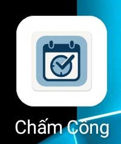
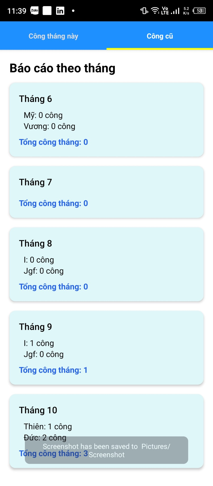
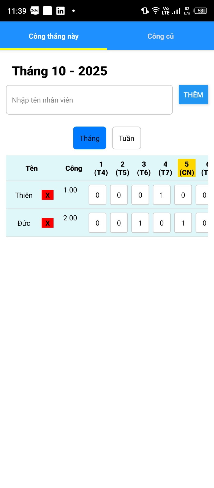

# Timekeeping App

Basic, easy-to-use **timekeeping application** for general users.  
This project is built with [**React Native**](https://reactnative.dev).

## Features

- 👷 Add and remove workers  
- 🕒 Daily attendance tracking  
- 📅 Monthly attendance summary and report  

---

## Screenshots

### App Icon


### Monthly Report


### Daily Attendance


---

# Getting Started

> **Note**: Make sure you have completed the [Set Up Your Environment](https://reactnative.dev/docs/set-up-your-environment) guide before proceeding.

## Step 1: Start Metro

```sh
# Using npm
npm start

# OR using Yarn
yarn start
```

## Step 2: Build and run your app

### Android

```sh
# Using npm
npm run android

# OR using Yarn
yarn android
```

### iOS

```sh
bundle install
bundle exec pod install

# Using npm
npm run ios

# OR using Yarn
yarn ios
```

---

# Modify Your App

Open `App.tsx` in your text editor of choice and make some changes. When you save, your app will automatically update — powered by [Fast Refresh](https://reactnative.dev/docs/fast-refresh).

---

# Troubleshooting

If you're having issues getting the above steps to work, see the [Troubleshooting](https://reactnative.dev/docs/troubleshooting) page.

---

# Learn More

- [React Native Website](https://reactnative.dev)  
- [Getting Started](https://reactnative.dev/docs/environment-setup)  
- [Learn the Basics](https://reactnative.dev/docs/getting-started)  
- [Blog](https://reactnative.dev/blog)  
- [`@facebook/react-native`](https://github.com/facebook/react-native)  
